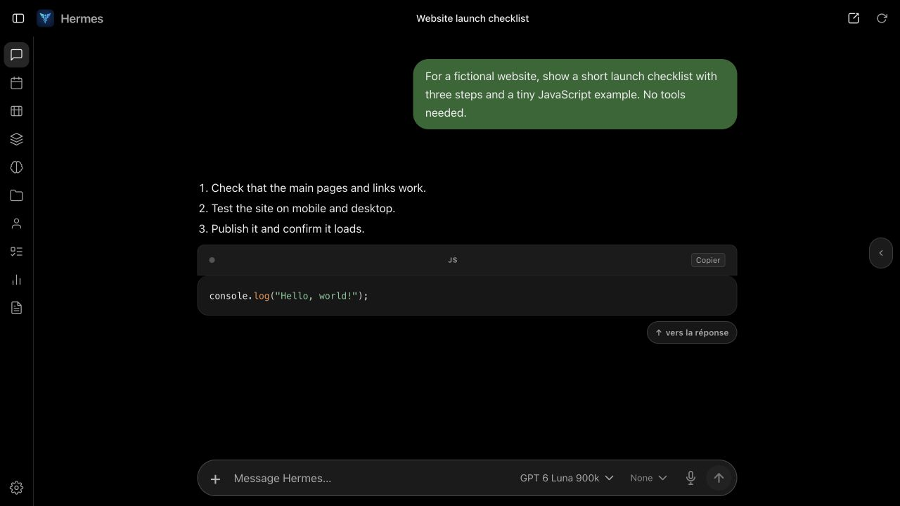
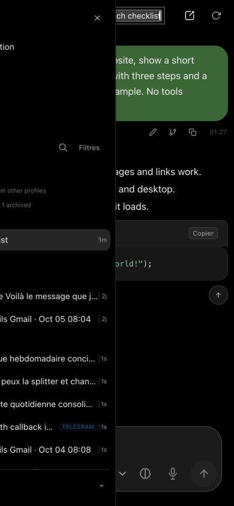
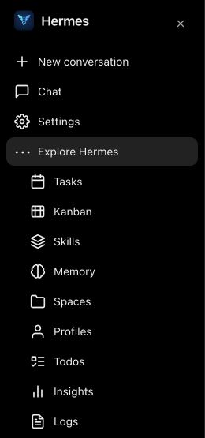
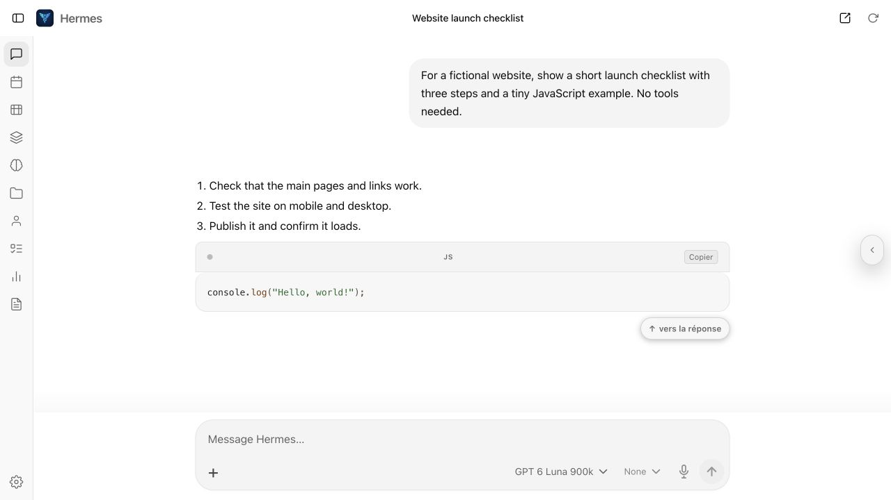

# Selene — a ChatGPT-inspired theme for Hermes WebUI

Selene is a **ChatGPT-inspired theme for [Hermes WebUI](https://github.com/nesquena/hermes-webui)**, bringing a familiar ChatGPT-style interface to Hermes Agent on desktop and mobile. It combines light and dark themes, responsive chat controls and a cleaner sidebar while keeping its own name and Hermes branding.



<p>
  
  
</p>



## ChatGPT-style appearance, native Hermes features

For users looking for a Hermes WebUI theme that looks like ChatGPT, Selene adapts the spacing, typography, composer, menus and motion. It preserves Hermes' native model, reasoning, profile and tool controls. Install it as a custom theme extension without forking Hermes or building a custom image.

## What changes

- Light and dark palettes, restrained typography, rounded menus and visible keyboard focus.
- A centered welcome composer, conversation title in the header and a compact mobile composer.
- One row for add, model, reasoning, microphone and send. On mobile, reasoning uses its native brain icon; long model names use ellipsis.
- A unified sidebar with indented secondary navigation under **Explore Hermes**, a search toggle and a native profile switcher.
- Sidebar navigation and lists scroll together between the fixed header and pinned profile footer.
- Menu and drawer transitions that respect reduced-motion preferences.

Selene is **not a Hermes fork**. It uses Hermes WebUI's extension loader and `window.registerHermesSkin()`. CSS handles styling; a small JavaScript presentation layer moves existing controls, retains their IDs and handlers, and restores their original positions when another skin is selected. It changes some layout and navigation presentation, so it is more than an accent-only CSS skin.

No core WebUI or Hermes Agent source files are patched. No build step, runtime dependencies, external fonts, telemetry, network requests or application API calls are included. The extension observes the draft textarea only to choose compact or expanded composer styling; it does not save or transmit draft text or read conversation content. Extensions still execute inside the authenticated WebUI page: review the code before installing it, as with any WebUI extension.

## Requirements

A Hermes WebUI build with the [extension manifest loader](https://github.com/nesquena/hermes-webui/blob/master/docs/EXTENSIONS.md) and native skin registration. Tested with WebUI build `exp-v0.52.404` in October 2026.

The tested build preserves extension skin selection in browser-local preferences. Its server settings may normalize custom skin names to Default, so choose Selene separately on each browser/device. Recheck compatibility after WebUI updates: native DOM classes and component layouts may change.

## Install

### Community gallery

Open **Settings → Extensions**, find **Selene**, and install it. Reload the page, then choose **Settings → Appearance → Skin/Style → Selene** and select Light, Dark or System.

If your gallery does not include Selene yet, use the manual installation below. Gallery availability follows the library's registry publication.

### Manual installation

### Local installation

Clone the repository on the machine that runs Hermes WebUI:

```sh
git clone https://github.com/Charles-HL/hermes-webui-selene.git
```

Alternatively, download the latest `selene-*.zip` from [Releases](https://github.com/Charles-HL/hermes-webui-selene/releases), then extract it. The archive contains a `selene/` directory with `manifest.json` and `assets/`.

Point the WebUI process at the extracted directory or checkout:

```sh
export HERMES_WEBUI_EXTENSION_DIR=/absolute/path/to/hermes-webui-selene
export HERMES_WEBUI_EXTENSION_MANIFEST=manifest.json
```

Use `/absolute/path/to/selene` instead if you extracted the release archive. Restart WebUI using your normal launch method after setting these environment variables, then reload your browser.

Open **Settings → Appearance → Skin/Style → Selene**. Choose **Light**, **Dark** or **System** separately. Installing the extension does not automatically select it.

### Docker / Compose

Merge this fragment into your existing WebUI service, keeping its current image, state volume, ports and authentication:

```yaml
services:
  webui:
    volumes:
      - ./hermes-webui-selene:/opt/webui-extensions/selene:ro
    environment:
      HERMES_WEBUI_EXTENSION_DIR: /opt/webui-extensions/selene
      HERMES_WEBUI_EXTENSION_MANIFEST: manifest.json
```

Recreate the WebUI service with your normal Compose command after changing its environment or mounts. Then reload the browser and select **Selene** in Appearance. No custom image is needed.

### Already using extensions?

Do not replace your existing extension configuration. Put Selene under your current extension root and add its entry to your configured bundle manifest, adjusting asset paths to include the subdirectory:

```json
{
  "extensions": [
    {
      "id": "selene",
      "scripts": ["selene/assets/theme.js", "selene/assets/layout.js"],
      "stylesheets": ["selene/assets/theme.css"]
    }
  ]
}
```

Keep your other entries in that array. Relative paths resolve from the bundle manifest's directory. An explicit manual manifest takes precedence over gallery-installed manifests in the tested loader, so preserve all extensions you intend to load. See the [upstream extension documentation](https://github.com/nesquena/hermes-webui/blob/master/docs/EXTENSIONS.md) for your installation's loader behavior.

## Update or remove

Update the checkout with `git pull`, or replace the release's `manifest.json`, `extension.json` and complete `assets/` directory, then reload the browser. Fully close and reopen a cached installed app if necessary. An environment change requires restarting/recreating the WebUI service; an asset-only update normally does not.

To disable the presentation immediately, choose another skin in Appearance. For a gallery installation, disable or uninstall Selene in **Settings → Extensions** and reload. For a manual installation, remove Selene's entry from your bundle, or remove its two environment variables if it is your only manually configured extension. Restart WebUI and remove the package after selecting another skin. Conversation data and Agent configuration are unaffected.

## Community gallery

Hermes WebUI already supports community extensions through [hermes-webui-extensions](https://github.com/hermes-webui/hermes-webui-extensions), including skin extensions. The [library submission](https://github.com/hermes-webui/hermes-webui-extensions/pull/100) tracks review and publication.

The preferred contribution is a PR to that extension library, where maintainers can review the package and make it available through **Settings → Extensions**. A core WebUI PR is not required to install Selene. See [contribution notes](docs/CONTRIBUTING.md).

## Navigation and control behavior

User-hidden composer controls stay hidden. Clicking an already active navigation tab retains Hermes' native sidebar collapse behavior. A collapsed desktop sidebar keeps the native rail; its New conversation header action appears only when the sidebar is collapsed. The mobile drawer uses the viewport width up to 360 px. Mobile composer controls have 44 px touch targets, and the `+` menu exposes the native context usage and compression row. Provider quota values and project chips remain visible. The centered conversation title retains native rename/tap handlers; Reload remains a global header action.

## Compatibility and scope

The theme is a visual adaptation, not a complete reproduction of ChatGPT or its features. Model and reasoning choices, permissions, approvals, tools, speech services and streaming remain provided by Hermes. Profile/model switching internals and real-device keyboard behavior were not exhaustively tested. See [validation notes](docs/VALIDATION.md).

MIT licensed. Independent project; not affiliated with OpenAI, Nous Research or the Hermes WebUI maintainers. No OpenAI logos, proprietary fonts or application source are bundled. The Hermes mark shown in screenshots is rendered by the installed WebUI, not redistributed as a separate asset.
